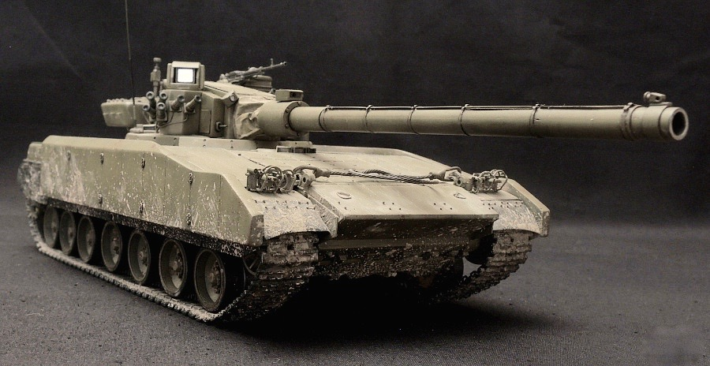
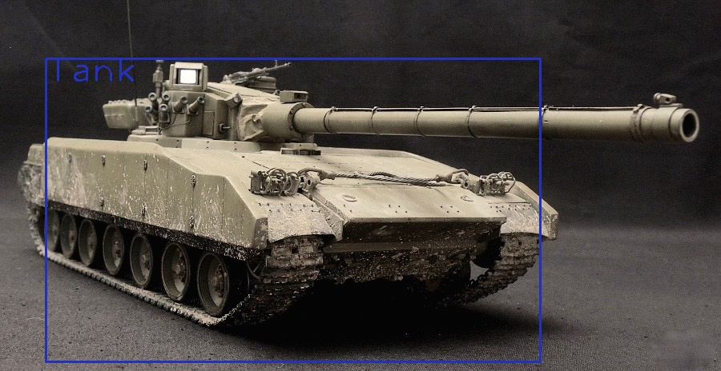

# tank_detection

Program with a web interface that recognizes tanks in photos using YOLOv3.

## Get started

- You need to have python 3.<br/>
- Clone the repository and install requirements.txt.
```
git clone https://github.com/pashakres/tank_detection.git
cd tank_detection
```
```
pip install requirements.txt 
```

- [Download](https://www.dropbox.com/sh/0zz45qfi8l8ie3q/AAC8IbQXjFV6ZiyFA7vH36tma?dl=0) *yolov3_testing.cfg* and *yolov3_training.weights*, 
then put them into *processing* folder
- You can now start the project
```
flask run
```
The site will work at the http://127.0.0.1:5000/

## Example

